# Architecture Document

This file maps the current logic pipeline of the `google-genai` agents.

## Core Flowchart

```mermaid
flowchart TD
    %% Define Styles
    classDef input fill:#f9f,stroke:#333,stroke-width:2px,color:#000;
    classDef agent fill:#bbf,stroke:#333,stroke-width:2px,color:#000;
    classDef logic fill:#bfb,stroke:#333,stroke-width:2px,color:#000;
    classDef output fill:#fbb,stroke:#333,stroke-width:2px,color:#000;
    classDef flag fill:#ff9,stroke:#e6b800,stroke-width:2px,color:#000;

    A[Document DB & Web Search]:::input --> B{Stage 1: Python Sieve}:::logic
    B -- "No Match" --> C[Zero-Cost Discard]:::output
    
    subgraph Discovery[Tiered Triage Pipeline]
        B -- "Keywords Matched" --> D(Stage 2: Local Bouncer / DeepSeek):::agent
        D --> E{Triage Score}:::logic
        E -- "LOW / SILENT_ANOMALY" --> F[Triage Log]:::output
        E -- "HIGH / MEDIUM" --> G(Stage 3: Cloud Specialist / Gemini):::agent
        G --> H{Final Relevance Score}:::logic
        H -- "LOW" --> I[Rejected Log]:::output
        H -- "HIGH / MEDIUM" --> J(Librarian / Auditor Agent):::agent
    end

    subgraph Evaluation[Evaluation Phase - The Auditor]
        J --> K{The Dynamic Switch}:::logic
        
        K -->|Tier 1: Manned| L[Human/Soul-First Priority]:::logic
        K -->|Tier 2: Remote w/ Downstream Risk| M[Balanced Priority]:::logic
        K -->|Tier 3: Isolated| N[Asset-First Priority]:::logic
        
        L & M & N --> O[Apply Logic Dictionary]:::logic
        O --> P(Extract Conflicts & Mechanisms)
    end

    subgraph OutputPhase[Output & Taxonomy Flags]
        P --> Q[JSON Final Analysis]:::output
        P -.-> R[🚩 SYSTEMIC OMISSION]:::flag
        P -.-> S[🚩 INHERENT FRICTION]:::flag
        P -.-> T[🟡 OUT OF SCOPE]:::flag
        P -.-> U[🚩 PROMPT EVOLUTION TRIGGER]:::flag
        E -.-> V[🚩 SILENT ANOMALY]:::flag
    end
```

### Legend & Flags
* **SYSTEMIC OMISSION:** A macro framework fails to acknowledge physical safety despite safety being a direct output of its scope.
* **INHERENT FRICTION:** A necessary security control that intentionally creates tension with life-safety (e.g. locks during a fire).
* **OUT OF SCOPE:** The document is highly technical and truthfully does not intersect with operational physical safety.
* **PROMPT EVOLUTION TRIGGER:** This tells the AI that if it encounters *any* edge case, novel risk framework, or linguistic nuance that breaks the rules defined in `PROJECT_RULES.md`, it must flag it. This alerts the human researcher to update the `PROMPT_CHANGELOG.md` and evolve the definitions, preventing the AI from silently forcing data to fit where it doesn't belong.
