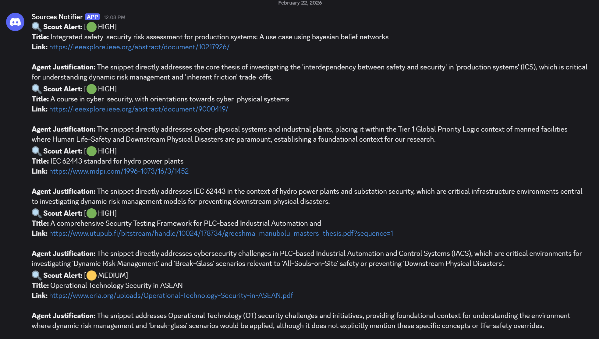

# Dynamic Risk Management: Cyber-Physical Research Pipeline

This is an evolving project and is constantly being developed as the research progresses. 

> **TL;DR:** This repository is an AI-powered pipeline designed to discover, read, and audit hundreds of technical documents (academic papers, government frameworks) to analyze how they handle physical life-safety emergencies in cyber-physical environments (e.g. power grid shutdowns, hospital ransomware).

## Table of Contents
1. [Project Overview](#1-project-overview)
2. [The Automation Pipeline](#2-the-automation-pipeline)
3. [Agent Directives: Controlling the AI](#3-agent-directives-controlling-the-ai)
4. [Adapting this Framework for Your Own Research](#4-adapting-this-framework-for-your-own-research)
5. [Directory Structure](#5-directory-structure)
6. [Getting Started](#6-getting-started)

## 1. Project Overview
This project investigates **Dynamic Risk Management** in critical infrastructure, specifically, models that shift organizations from rigid security postures to flexible, risk-informed, and resilient behaviors such as adaptability (the ability to recognize when one risk outweighs another), [graceful degradation](https://www.sciencedirect.com/topics/computer-science/graceful-degradation) (maintaining critical components while letting non-critical ones degrade) and [post-incident evolution](https://dl.acm.org/doi/10.1145/3643666.3648578) (adjusting the existing system to incorporate lessons learned from an incident). 

The core focus of this research is the **"Break-Glass" intersection**: the critical moment during an emergency where cybersecurity lockdowns must be intentionally degraded or bypassed to save lives or prevent a physical disaster. 

When these cyber-physical emergencies occur, practitioners are caught between two operational philosophies:
* **Cybersecurity (Traditionally Fail-Secure):** Defaults to locking systems down to protect data and hardware.
* **Emergency Management (Fail-Safe):** Defaults to keeping access open to preserve life and maintain critical operations.


To evaluate how different global frameworks (like NIST, ISO, and FEMA) handle this conflict, this project utilizes a semi-automated literature review pipeline. The pipeline uses a three-tier **Dynamic Switch** logic to determine how systems *should* behave in an emergency:

* **Tier 1: Manned Facilities (High Proximity):** In locations where humans are continuously present (e.g., hospitals, transport hubs), the rule is **Human/Soul-First**. Security must fail-open to ensure it never impedes escape routes or life-support for **All-Souls-on-Site** (e.g., a secure door opening during a fire, prioritizing biological life over data or hardware).
* **Tier 2: Remote Sites with Downstream Risk:** In unmanned locations controlling critical physical processes (e.g., remote power substations or dams), the rule is **Balanced**. The system must weigh the immediate physical safety of any potentially dispatched responders/crews against the potential for a secondary, community-level catastrophic event. Here, asset security (e.g., locking out hackers) *becomes* the primary safety mechanism to prevent the dam from flooding a town.
* **Tier 3: Isolated/Unmanned Sites:** In completely isolated environments with no immediate or downstream human risk (e.g., deep-space probes), the rule is **Asset-First**, prioritizing strict mission continuity and hardware integrity above all else (e.g., bricking a system to protect data).

### Tech Stack & Models
* **AI Models:** Google Gemini (via `google-genai` API) for both discovery reasoning and technical extraction.
* **Vector Database:** Qdrant (`qdrant-client`) for local, disk-persistent document embeddings and memory.
* **Search Tools:** `scholarly` for Google Scholar academic papers, and `ddgs` for general web/grey literature.
* **Notifications:** Discord Webhooks for real-time human-in-the-loop review alerts.

---

## 2. The Automation Pipeline
Reading hundreds of technical frameworks, academic papers, incident reports, and other relevant pieces of media manually is a massive bottleneck. To solve this, the project uses local Python scripts and AI to automate the discovery and note-taking process. The script was coded by Gemini and tested by me. The AI agent was built in Google Antigravity with Gemini and Claude used to refine the prompt logic.  

> **🤖 AI Co-Contributor Notice:**  
> This repository is actively co-maintained by **[Google Antigravity](https://antigravity.google/)**, an AI agentic coding assistant. Antigravity assists with writing the pipeline scripts, generating documentation (like `SETUP.md` and this `README`), refining AI rule prompts, and authoring `git` commits to ensure a rigorous audit trail of changes.  


The workflow is broken into three steps:

* **Step 1: Discovery (`scout.py`)** A **Pluggable Hybrid AI Agent**. Instead of passively scraping, it uses Gemini to dynamically brainstorm optimized search queries based on your broad research topics. It casts a wide net, evaluating peer-reviewed papers via **Google Scholar** and [grey literature](https://en.wikipedia.org/wiki/Grey_literature) (whitepapers, government directives, etc.) via **DuckDuckGo**. The agent reads title snippets and abstracts, rigorously scoring them against the `PROJECT_RULES.md` before sending high-quality hits to Discord for manual review. It maintains a smart memory and logs low-quality hits for future auditing.
  > 
  > 
  > **🏛️ Architecture Note (Decoupled Pipeline):**  
  > Discovery (`scout.py`) and Auditing (`librarian.py`) are deliberately kept **strictly decoupled**. Scout does *not* automatically download PDFs. This "Human-in-the-Loop" architecture empowers the researcher to manually source PDFs from paywalled, physical, or university-restricted library catalogs that the automated scraper cannot access, dropping them freely into the `sources/` pipeline. This basically lets us add sources from places that the scout does not have access to. Also this is done so you can further validate the sources before doing the technical extraction.
  > 
  > **🏛️ Architecture Note (Reproducible Memory):**  
  > The Scout's "smart memory" log (`seen_sources.txt`) is intentionally tracked via Git in this repository. This provides a mathematically auditable, transparent history of every search query executed and every document the AI rejected as `LOW` relevance, guaranteeing the dataset collection methodology is academically reproducible.
  
* **Step 2: Technical Extraction (`librarian.py`)** A script that uses an AI model (Gemini) to read the downloaded PDFs. Instead of generating general summaries, the AI is programmed to extract specific decision models, safety triggers, and framework rules. It saves these notes as clean Markdown text files.
  > *(See an example of an AI-generated report in [examples/NIST.SP.800-53r5_audit.md](./examples/NIST.SP.800-53r5_audit.md))*
* **Step 3: Synthesis** The extracted notes and metadata are pushed via a command-line interface into NotebookLM. This creates a searchable, private Retrieval-Augmented Generation (RAG) library that I can use to connect the dots, map frameworks together, and draft the final analysis.

---

## 3. Agent Directives: Controlling the AI

I didn't want the AI to summarize or draw conclusions for me. I want to do the analysis myself. So, to force the AI to produce rigorous, usable data, it operates under strict rule files located in the `.agent/` directory:

### A. The Master Rules (`PROJECT_RULES.md`)
This file acts as the AI's logic board:
* **Priority Logic:** Enforces the 3-tier Dynamic Switch (Human/Soul-First vs. Asset-First) mentioned above.
* **Technical Translation Dictionary:** Equips the AI to translate jargon across industries. For example, if a cybersecurity paper mentions "Privilege Escalation," the AI tags it as a physical "Break-Glass" mechanism. It also translates organizational terms like "Personnel" into universal safety terms like "All-Souls-on-Site."
* **Conflict Categorization:** Classifies tension between security and safety into three distinct flags:
  * 🚩 **[INHERENT_FRICTION]:** Expected operational trade-offs (e.g., secure locks blocking rapid egress).
  * 🚩 **[SYSTEMIC_OMISSION]:** Crucial safety omissions in an OT context (the "Silent Document").
  * 🟡 **[OUT_OF_SCOPE_SILENCE]:** Documents where safety is genuinely outside their technical purview.
* **The Evolution Directive:** Instructs the AI to be iterative and act as a global "bug bounty." If the AI reads a paper that introduces a completely novel concept (e.g., an unprecedented architectural framework or international protocol not currently in the Logic Dictionary), it must flag a suggested rule update. Crucially, this directive is flexible enough to catch *any* unanticipated edge-case, including formatting glitches, broken PDF OCR, missing page numbers, or script logic failures—ensuring the human researcher can patch the pipeline based on the AI's feedback.

### B. The Auditor Persona (`auditor.md`)
This file dictates *how* the AI reads the text and formats its notes:
* **Source Classification & Rigor Audit:** The AI weighs Official Frameworks, Peer-Reviewed Journals, and Theses differently. It also features a **Grey Literature Override**: expert blogs or unreviewed papers are immediately discarded unless they specifically discuss novel "Dynamic Risk" architecture or framework gaps.
* **The Persona & Kill Switch:** The AI acts exclusively as a "Senior Cyber-Physical Resilience Auditor." The tension between Human Life-Safety (emergency egress, environmental containment) and Asset Security (CIA triad, system uptime) is the core of this audit. 
  * **The Kill Switch ("IT-Centric Check"):** It is instructed to immediately stop reading and skip any document that is 100% focused on information security (data loss) with zero physical consequences. 
  * **The Rationale:** Many IT-centric frameworks are "Silent" on safety. Without this scope gate, the pipeline would be cluttered with irrelevant audits or false-positive conflicts where standard IT security practices (like locking a server rack) are flagged as "safety violations" simply because they restrict access. This ensures we only ingest data with a true operational technology (OT) nexus.
* **70% Parity Mapping:** When comparing different global frameworks, the AI is forbidden from using simple keyword matching. A mapping is only valid if it meets 3 out of 4 functional criteria: *Target* (same asset), *Intent* (same goal), *Hazard* (same consequence), and *Phase* (same timeline).
* **FEMA Lifeline Translation:** To bridge the gap between digital and physical impacts, the AI maps any extracted cyber failures directly to FEMA's 7 Community Lifelines (e.g., mapping a "network outage" directly to the physical "Energy" impact). These lifelines are mapped to ISO critical sectors to account for international frameworks and terminology. 

### C. The Transparency Log ([.agent/PROMPT_CHANGELOG.md](./.agent/PROMPT_CHANGELOG.md))
To ensure complete academic transparency, any adjustments made to the AI's logic, output constraints, or project rules are formally documented in the [.agent/PROMPT_CHANGELOG.md](./.agent/PROMPT_CHANGELOG.md) file. This prevents "shadow modifications" of the research methodology and guarantees that the AI's operating parameters remain auditable from the project's inception.

---

## 4. Adapting this Framework for Your Own Research
This setup is highly adaptable. While this specific project focuses on translating cybersecurity doctrine into operational emergency management risk, the underlying code can be used for large-scale literature reviews in any field. 

To use it for a different project, you will need to replace the search terms in the `scout.py` script and rewrite the agent prompts and rule files to force the AI to evaluate literature against your specific domain's theoretical frameworks. It is important to note that while the AI makes decisions during this process based on your rules, this pipeline is primarily designed to rapidly sort, extract, and catalog data. The final analysis and conclusions are still drawn by you.

---

## 5. Directory Structure
```text
/Cyber-Physical-Resilience
├── README.md            # You are here
├── SETUP.md             # Installation & Usage Instructions
├── LICENSE              # MIT Open-Source License
├── scout.py             # Discovery & Smart Memory script
├── librarian.py         # AI Auditor script
├── seen_sources.txt     # The Scout's memory log
├── .env                 # API Keys & Path Configs
├── sources/             # Raw PDF storage for ingestion
├── audits/              # Generated Markdown notes
├── examples/            # Sample generated outputs
└── .agent/    
    ├── PROMPT_CHANGELOG.md   # Logs changes to AI instructions for academic rigor
    ├── rules/           
    │   └── PROJECT_RULES.md  # Core project constraints & priority logic
    └── skills/          
        └── auditor.md        # Librarian persona & evaluation logic


```
## 6. Getting Started
If you are cloning this repository to run your own pipeline, please refer to the **[SETUP.md](./SETUP.md)** file for detailed instructions on required dependencies, environment configuration (`.env`), and how to run the components.

Before running the pipeline at scale, it is highly recommended to conduct a calibration phase to ensure the AI's extraction logic perfectly aligns with your research domain. See the **[CALIBRATION_GUIDE.md](./CALIBRATION_GUIDE.md)** for instructions on this manual validation process.
