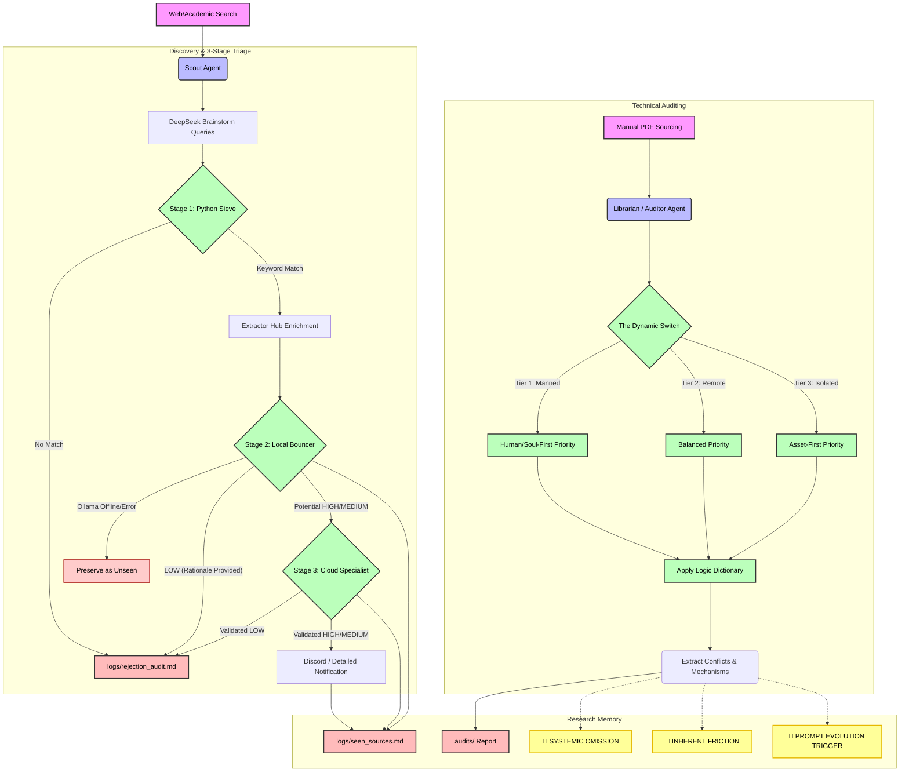

# Architecture Document

This file maps the current logic pipeline of the `google-genai` agents.

## Core Flowchart

### System Architecture Components

1.  **3-Stage Discovery Triage**:
    *   **Python Sieve**: Lexical filter to reduce API costs by discarding non-contextual noise.
    *   **Extractor Hub**: Attempts to enrich snippets with full-text content before secondary evaluation.
    *   **Local Bouncer (Ollama)**: Uses `deepseek-r1:8b` for cost-effective broad screening. Includes "Resilience Failure Mode" where technical errors skip logging to prevent false-negative data poisoning.
    *   **Cloud Specialist (Gemini)**: Performs final precision scoring and detailed researcher notification.

2.  **Log Consolidation (The Audit Trail)**:
    *   **`seen_sources.md`**: The source of truth for all evaluated URLs, preventing duplicates.
    *   **`rejection_audit.md`**: A unified log of all `LOW` relevance findings, fulfilling the Academic Rigor requirement for negative results.

### Legend & Flags
* **SYSTEMIC OMISSION:** A macro framework fails to acknowledge physical safety despite safety being a direct output of its scope.
* **INHERENT FRICTION:** A necessary security control that intentionally creates tension with life-safety (e.g. locks during a fire).
* **[CLAIR_SILO]**: Identifies frameworks that fail to acknowledge failure vectors outside traditional SCADA boundaries (Levels -1, 6, 7). [Link to CLAIR Model](https://isc.sans.edu/diaryimages/images/The_CLAIR_Model.pdf)
* **PROMPT EVOLUTION TRIGGER:** An audit signal that there is a gap in the `PROJECT_RULES.md` and a methodology update is required.
